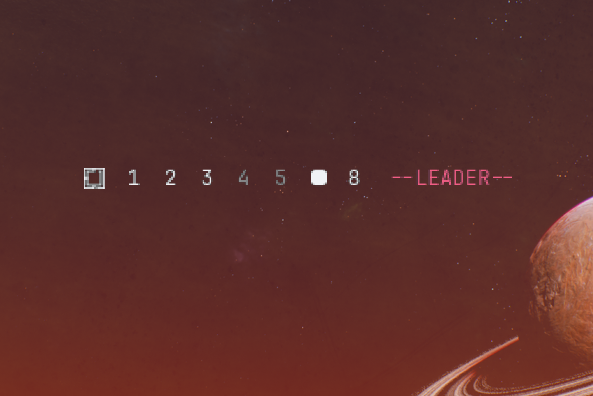
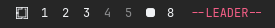

# Omarchy Submap 

This plugin provides a live status indicator for your active Hyprland submap. It shows the current submap name in your Omarchy bar, providing clear visual feedback when you enter modes like resize, launch, or leader-key layers.





## How it works

The indicator subscribes to Hyprland's `submap` IPC event for zero-latency updates. It automatically hides in the default keymap, ensuring your bar remains clutter-free. On shell startup it also queries `hyprctl submap` once, covering shell restarts that happen while a submap is already active.

## Install

```bash
omarchy plugin add https://github.com/sohanemon/omarchy-submap.git --enable
```

Pick a bar section when prompted (it defaults to `left`, next to the workspaces). You can move it later with:

```bash
omarchy bar move io.github.sohanemon.submap --section center
```

## Uninstall

```bash
omarchy plugin remove io.github.sohanemon.submap
```

## Requirements

* Omarchy 4.0 "quattro" or later (Quickshell-based shell).

## License

[MIT](LICENSE)

## Publisher

This plugin is maintained as part of the Omarchy ecosystem.
